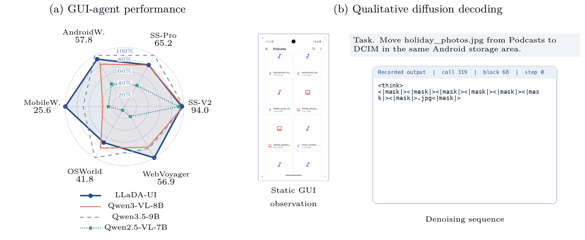
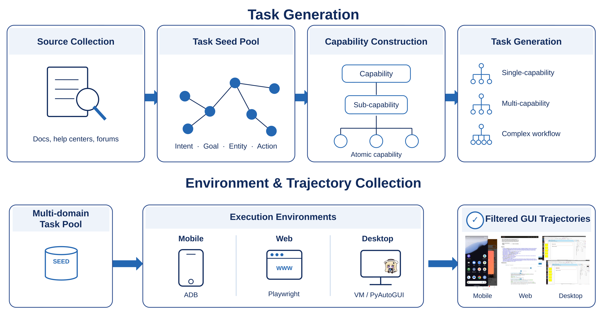
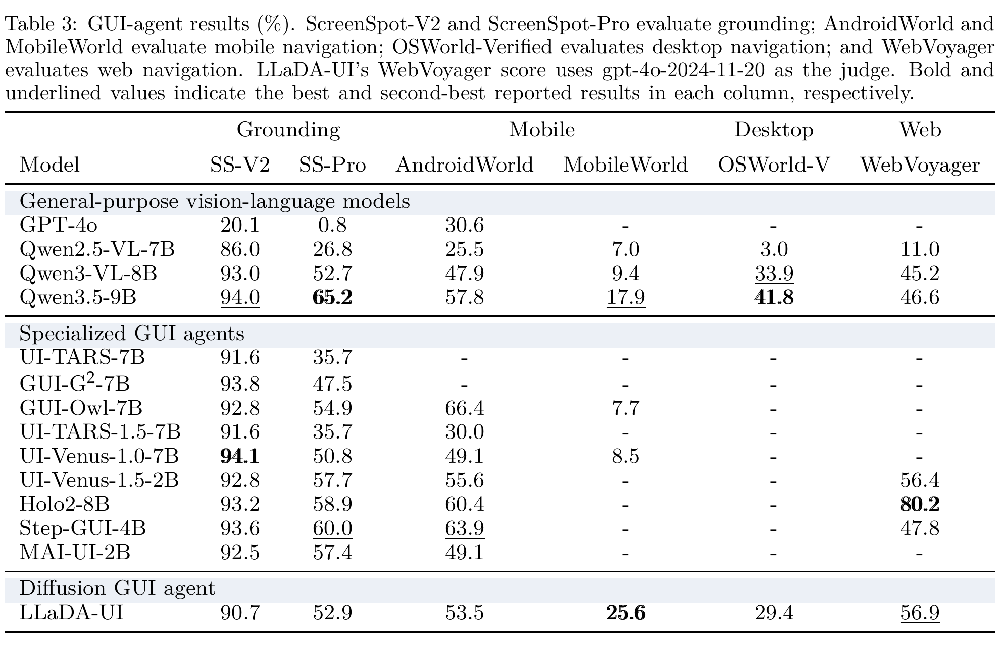
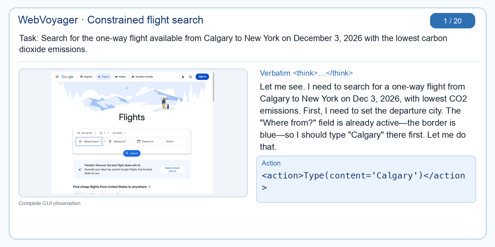
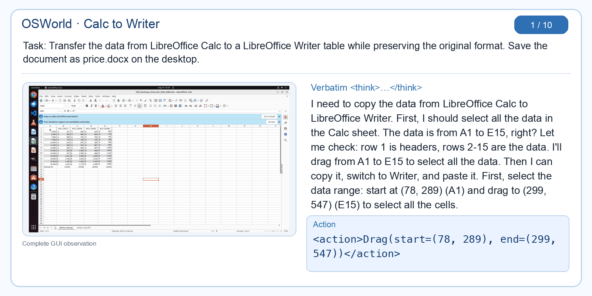
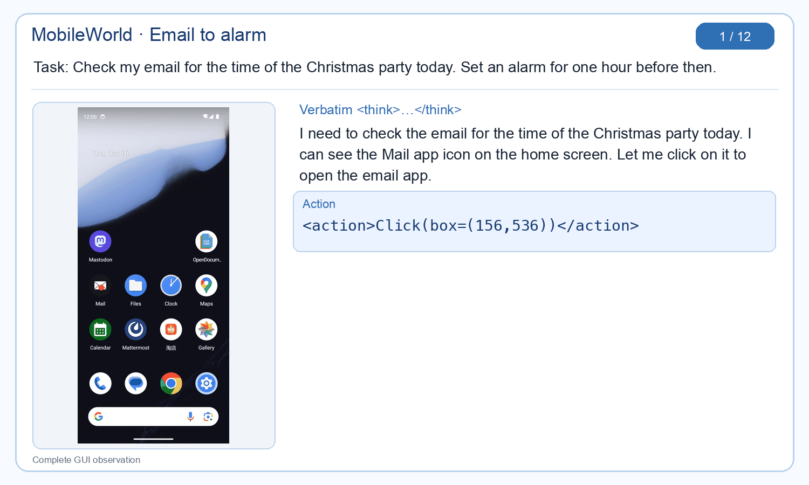

<h1 align="center">LLaDA-UI</h1>

<h3 align="center">Bringing Block-wise Diffusion to Vision-Language GUI Agents</h3>

<p align="center">
  <a href="assets/LLaDA-UI-paper.pdf"></a>
  <a href="https://www.inclusion-ai.org/LLaDA-UI/"></a>
  <a href="https://huggingface.co/inclusionAI/LLaDA-UI"></a>
  <a href="https://github.com/inclusionAI/LLaDA-UI"></a>
</p>

<p align="center">
  <a href="#highlights"></a>
  <a href="#highlights"></a>
  <a href="#highlights"></a>
  <a href="#highlights"></a>
</p>

LLaDA-UI is an MoE-based, block-wise diffusion vision-language GUI agent.
It combines a native dynamic-resolution vision encoder with the
LLaDA2.0-mini-base diffusion language backbone, and generates reasoning and GUI
actions through the same block-wise diffusion decoder.

<p align="center">
  
</p>

<p align="center"><em>Figure 1. LLaDA-UI GUI-agent performance and qualitative block-wise diffusion decoding. The radar chart and GUI observation remain static while the model output is progressively denoised.</em></p>

## Highlights

- **Diffusion-native multimodal agent:** LLaDA-UI extends a masked diffusion
  language model to visual understanding and executable GUI interaction.
- **MoE architecture:** approximately 16.7B total parameters end to end.
- **Two-stage training:** large-scale multimodal pre-training aligns a
  native-resolution SigLIP-initialized ViT with LLaDA2.0-mini-base, followed by
  GUI-agent supervised fine-tuning.
- **Cross-platform interaction:** training covers grounding, mobile, desktop,
  and web tasks, including data from more than 100 Chinese mobile applications
  and more than 70 English mobile applications.
- **Competitive GUI performance:** LLaDA-UI outperforms Qwen2.5-VL-7B across
  all six reported GUI benchmarks and surpasses Qwen3-VL-8B on ScreenSpot-Pro,
  AndroidWorld, MobileWorld, and WebVoyager.
- **Diffusion-specific analysis:** the accompanying report studies structured
  action validity, trajectory-length effects, EOS handling, denoising steps,
  and block size.

## Model Overview

| Item | Description |
|---|---|
| Model type | MoE block-wise diffusion vision-language GUI agent |
| Total parameters | Approximately 16.7B end-to-end |
| Language backbone | LLaDA2.0-mini-base |
| Vision encoder | Native-resolution ViT initialized from SigLIP, with 2D RoPE |
| Vision-language connector | Spatial 4-to-1 feature grouping followed by a two-layer MLP projector |
| Output | Text reasoning and structured GUI actions |
| Spatial convention | Normalized coordinates in `[0, 999]` |
| Training stages | Multimodal pre-training, then GUI-agent SFT |
| Supported domains | GUI grounding, mobile, desktop, and web |

## Training and Inference Pipelines

### Inference Pipeline

<p align="center">
  
</p>

<p align="center"><em>Figure 2. GUI observations from web, mobile, and desktop environments are encoded at native resolution and combined with task and interaction-history tokens. The LLaDA2.0 decoder progressively denoises the model output into reasoning and executable actions.</em></p>

### GUI Data Generation

<p align="center">
  
</p>

<p align="center"><em>Figure 3. Overview of the GUI data-generation pipeline, from task construction and sub-skill decomposition to compositional trajectory collection and quality control.</em></p>

## Benchmark Results

### GUI-Agent Evaluation

<p align="center">
  
</p>

<p align="center"><em>GUI-agent evaluation reproduced directly from Table 3 of the technical report.</em></p>

Evaluation versions, task counts, prompts, reset policies, action limits,
serving backends, and baseline provenance will be documented in the final
release.

## Qualitative GUI-Agent Traces

The following GIFs replay complete successful trajectories. Every frame shows
the original screenshot together with the verbatim model output for that step.

### WebVoyager: constrained flight search

<p align="center">
  
</p>

LLaDA-UI configures a one-way Calgary-New York flight, navigates to December
3, 2026, applies the lower-emissions constraint, and returns the verified
lowest-CO2 itinerary over a 20-step trajectory.

### OSWorld: Calc to Writer

<p align="center">
  
</p>

LLaDA-UI selects a formatted table in LibreOffice Calc, transfers it to
Writer, and saves the resulting document as `price.docx` on the desktop.

### MobileWorld: email to alarm

<p align="center">
  
</p>

LLaDA-UI reads the 7:00 PM Christmas-party time from email, computes the
one-hour offset, opens the Clock application, and verifies the enabled 6:00 PM
alarm.

## Quickstart

Use separate environments for standalone Hugging Face inference and SGLang
serving because their tested Transformers and PyTorch versions differ.

### Hugging Face inference

[`inference/inference_hf.py`](inference/inference_hf.py) is a self-contained
grounding entry point; it does not require the training repository.

```bash
pip install torch==2.5.1 torchvision \
  --index-url https://download.pytorch.org/whl/cu124
pip install transformers==4.51.0 Pillow numpy einops accelerate \
  sentencepiece protobuf safetensors
pip install ninja
pip install flash-attn==2.7.4.post1 --no-build-isolation --no-cache-dir
```

Download the checkpoint from the
[LLaDA-UI Hugging Face repository](https://huggingface.co/inclusionAI/LLaDA-UI),
then pass its local directory to `--ckpt`:

```bash
CUDA_VISIBLE_DEVICES=0 IMAGE_MAX_PIXELS=12845056 \
python -u inference/inference_hf.py \
  --ckpt /path/to/hf_ckpt_unpacked \
  --image /path/to/screenshot.png \
  --prompt "close this window" \
  --gen-length 32 \
  --steps 32 \
  --block-length 32
```

The script prints the verbatim generation and parsed normalized point. Use
`IMAGE_MAX_PIXELS=1003520` for the default-resolution profile. ScreenSpot-V2
pipeline verification is also available; see `python inference/inference_hf.py
--help`.

### SGLang serving

[`inference/sglang_client.py`](inference/sglang_client.py) is a single-file,
standard-library client for an OpenAI-compatible endpoint. Use a dedicated
serving environment and follow the [minimal server recipe](inference/sglang_server/README.md):

```bash
CUDA_VISIBLE_DEVICES=0,1 SGLANG_DP_SIZE=2 \
bash serve_llada_ui.sh /path/to/hf_ckpt_unpacked
```

Then replay the packaged mobile, desktop, and web requests:

```bash
export SGLANG_BASE_URL=http://127.0.0.1:30000/v1
export SGLANG_MODEL=LLaDA-UI

python3 inference/sglang_client.py --example mobile
python3 inference/sglang_client.py --example desktop
python3 inference/sglang_client.py --example web
```

Each JSON embeds its screenshot and an evaluated current-image-only multi-turn
request. The packaged step-$t>0$ cases use the exact role sequence
`system, user(""), assistant(previous), user(current)`: the empty historical
user turn is followed by the latest raw `<think>...</think><action>...</action>`
response, while the final user turn contains text first and exactly one image,
the current screenshot. Historical screenshots are never replayed. Mobile keeps
its task/history headings in the current user caption; desktop and web keep the
task in the system prompt and use `Current Screenshot:` as the current caption.
At step 0, omit the empty user and previous assistant messages. Send another
compatible request with `python3 inference/sglang_client.py --request request.json`.

## GUI Action Format

For navigation, the model maps the task, current screenshot, and available
interaction history to tagged reasoning and a text-serialized action. A typical
response has the following form:

```text
<think>Reasoning grounded in the current GUI state.</think>
<action>Click(box=(x, y))</action>
```

Coordinates are integer-normalized to `[0, 999]`. The action vocabulary is
platform aware:

- **Mobile:** `Click`, `DoubleClick`, `LongPress`, `Drag`, `Swipe`, `Type`,
  `LaunchApp`, `Wait`, `CallUser`, `GetScreenshot`, device navigation,
  `Answer`, and `Finished`.
- **Desktop:** pointing actions, `RightClick`, `Drag`, `Swipe`, `Type`,
  `Hotkey`, `Wait`, `CallUser`, and `Finished`.
- **Web:** pointing actions, `Drag`, directional `Scroll`, `Hover`, `Type`,
  URL `Launch`, `Hotkey`, browser navigation, `CallUser`, and `Finished`.
- **Grounding:** directly returns `[x,y]`, with `[-1,-1]` for an infeasible
  request, rather than returning a navigation action.

Following the dominant training-data format, point-based navigation actions use
`box=(x,y)`. Here `box` denotes one normalized interaction coordinate rather
than a rectangular region.

## Citation

```bibtex
@techreport{lladaui2026,
  title  = {LLaDA-UI: Bringing Block-wise Diffusion to Vision-Language GUI Agents},
  author = {Zhangxuan Gu and Haoxing Chen and Qi Qin and Yi Xin and
            Kai Gan and Lin Liu and Long Cui and Xiaomei Wang and
            Beitong Zhou and Yunzhu Zhang and Zhengwen Zeng and
            Changlong Gao and Weizhi Chen and Rongchao Zhang and
            Haoyuan Wu and Shuheng Shen and Changhua Meng and Weiqiang Wang and
            Jianguo Li and Zhenzhong Lan},
  year   = {2026},
  url    = {https://huggingface.co/inclusionAI/LLaDA-UI}
}
```
